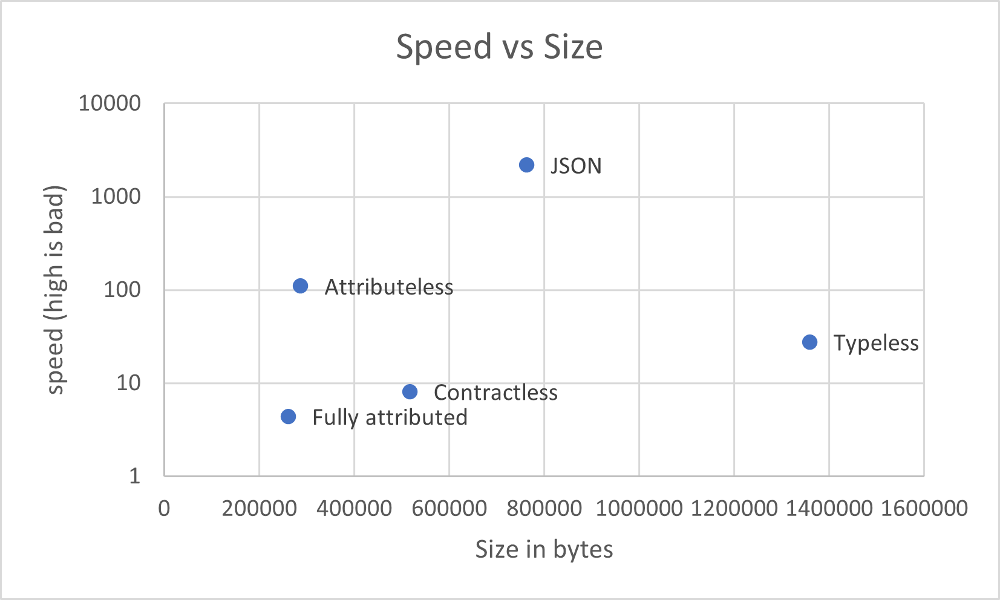

# MessagePack.Attributeless

 

[Motivation](#motivation) - [Release History](#release-history) - [Usage](#usage) - [Performance](#performance) - [Limitations](#limitations) - [License](#license)

## Motivation
MessagePack is fast and generates small destillates. However, it requires you to either attribute all or many of your types or to give up some of its size gain **and** add a potential security risk.
Out-of-the-box, it offers you basically three choices:

* use the default resolvers: this is where you need to attribute each and every property of your serializables and use additional attributes if you have polymorphic types; for this you get the fastest serialization/deserialization speeds and the smallest destillate size
* use contractless: here you don't need attributes, unless you have polymorphic types; speed is slower and destillate sizes are bigger
* use typeless: here you need to attributes at all, even for polymorphic types; speed is slowest and destillate sizes are biggest; in addition you risk deserializing a malicious destillate that tells the deserializer to create a type you never intended to be deserialized, with all the potential for hackery that follows; this might not affect you, though, if you use MessagePack in a context where you got complete control over destillates so they cannot be tampered with; if, on the other hand, your destillates go over the wire, for example, this is a very real risk

The purpose of MessagePack.Attributeless is to offer a fourth alternative, one that sacrifices some of the blazing speed of MessagePack to get small destillate sizes (almost as small as with the default resolver) with the comfort of not having to attribute your types and the safety of avoiding the kind of type-injection attack Typeless is open to. 

You may wonder what's the problem with attributes. There are quite a few:

1. what if the types are not under your control, that is, you cannot change their source-code?
1. what if you got a few dozen or maybe hundreds of domain types, each with quite a few properties, that you need to serialize? 
1. you bind something that is likely a domain concept to something that is infrastructure
1. if you ever decide to change your serialization format, you'll have to touch all your domain types again

## Release History
<!-- 1.0.0: initial release -->
not yet released

## Usage

## Performance
Performance data was generated running the `MessagePack.Attributeless.Microbenchmark` project in release mode outside the debugger with `-n 1000 -r 100 -j`. Feel free to check the source - if you find something you think is not right, feel free to open a discussion.

In all diagrams, JSON is added as a reference.

The following diagram puts the four methods on a coordinate-system between size and speed.

The speed metric is derived from multiplying the average time to serialize one array of 1000 complex elements with the average time to deserialize it, in other words it's directly proportional to serialization and deserialization speed. The axis is logarithmic.

The size metric is simply the size of the destillate, the serialized form of said array of 1000 complex elements, in bytes.

As you can see, JSON is by far the slowest while Fully Attributed - the standard resolver of MessagePack - is the fastest.

In absolute terms, the comparison looks like this:

| Method | Serialize (ms) | Deserialize (ms) |
| ------ | -------------- |----------------- |
| Attributeless | 9.2 | 12.0 |
| Fully attributed | 2.2 | 2.0 |
| Contractless | 3.0 | 2.7 |
| Typeless | 5.4 | 5.1 |
| JSON | 34.9 | 62.6 |

If speed is your primary metric, you should use Fully Attributed - it's about 16(!) times faster than JSON for serialization and almost 31 times faster for deserialization. 

Attributeless is clearly the slowest of the four MessagePack methods, but it's still almost 4 times as fast as JSON for serialization and 5 times as fast for deserialization.

Looking at size, on the other hand, surprisingly Typeless is even worse than JSON, and Attributeless is almost as small as the standard resolver.

This is runtime performance - but how about development productivity? How many attributes do we have to add with each method and how many domain types do we need to touch to enable serialization?

| Method | Types touched | Number of Attributes added |
| ------ | ------------- | -------------------------- |
| Fully attributed | 10 | 25 |
| Contractless | 2 | 5 |
| JSON | 0 | 0 |
| Typeless | 0 | 0 |
| Attributeless | 0 | 0 |

As you can see, Attributeless requires no touching of your types at all, same as JSON and Typeless, while Fully Attributed is the most intrusive option.

(In case you wonder how the benchmark dealt with polymorphic types in JSON, take a look at the excellent [JsonSubtypes](https://github.com/manuc66/JsonSubTypes) library.)

Obviously, these numbers very much depend on your domain types. The benchmark, for example, has 2 polymorphic hierarchies. If your domain model has none, then Contractless will require zero types being touched and zero attributes, just like JSON or Typeless or Attributeless. Vice versa, if you got a lot more, the numbers will rise.

### Conclusion - which serializer and settings to pick?
It all depends on your use-case. Here are a few ideas:

Do you have a large domain model or just a few types? If the former, you should seriously consider Attributeless, if the later, Fully Attributed or Contractless might be right for you.

What is more important for you, size or speed? If the former, you should consider Fully Attributed or Attributeless, if the later, Fully Attributed or Contractless.

How dramatic are your speed requirements? If every millisecond counts, you definitely need Fully Attributed. On the other hand, if you need fast, but you don't need to shave of every millisecond possible, Attributeless with its significantly greater development comfort and OOD comformance is likely the right choice.

How likely are you to change your serializing protocol in the future or having to support multiple protocols? If you can commit to MessagePack and MessagePack only for the indefinite future, then Fully Attributed will work for you. If you need to support multiple formats or consider a change of format not unlikely over the lifetime of your product, then you will prefer Attributeless.

## Limitations 
Compared to MessagePack out-of-the-box, Attributeless introduces a few limitations. These limitations are by design and reflect a tradeoff of both lower development and runtime complexity for not supporting certain edge cases:

* Serializable types all must be default-constructable and public 
* Serializable properties must be public and writeable
* indexer properties are not serialized or deserialized

## License
The [license](./LICENSE) is [Creative Commons BY-SA 4.0](https://creativecommons.org/licenses/by-sa/4.0/). In essence this means you are free to use and distribute and change this tool however you see fit, as long as you provide a link to the license
and share any customizations/changes you might perform under the same license. 

